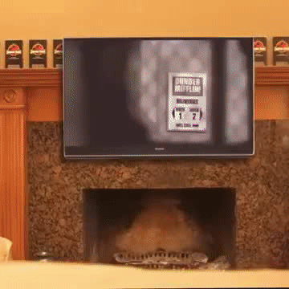

# Image-Captioning-Project

## Introduction
This repository contains my implementation of a video captioning system. This system takes as input a **video** and generates a **caption** describing the event in the video. 

## Requirements
For running our code and reproducing the results, the following packages need to be installed first. We have used Python 3.6 for the whole of this project.

PIP Packages:
* numpy
* argparse
* imutils
* cv2

Also you should download the pre-trained YOLO v3 weights file from this link and place it in the current directory or you can directly download to the current directory in terminal using

$ wget https://pjreddie.com/media/files/yolov3.weights

## Running instructions

Run main.py file using command:

$ python main.py

in this case this will be object detection and captioning from your web cam live. To exit cam window press '**q**'

You can also do video captioning on already prerecorded videos. The result will be saved to output/output.avi. Just use argument -v / --video [path to video file].
Example:

$ python main.py --video input/input.avi

In case you want to change file name and location where processed video will be saved to use argument --output
To change confidence level and threshold parameters use arguments --confidence and --threshold respectively.

**video_recorder.py** is a program with which help you can record video from your webcam and the result will be saved to input/input.avi. Press **q** to finish recording. Run with:
$ python video_recorder.py

## Demo uploaded video

## Demo live web cam part 1

## Demo live web cam part 2

